# BudgetPro — İstifadəçi Təlimatı

> **Enterprise Holding Risk Terminal**
> Bu nədir, necə istifadə etmək olar, nəyi və harada yoxlamaq lazımdır.
> Müştəri, maliyyə direktoru və holdinq admini üçün.

---

## Mündəricat

1. [Bu nədir və nə üçündür](#1-bu-nədir-və-nə-üçündür)
2. [Giriş və naviqasiya](#2-giriş-və-naviqasiya)
3. [Risk Terminal — maliyyəçinin iş günü](#3-risk-terminal--maliyyəçinin-iş-günü)
4. [Board Deck — şura üçün snapshot](#4-board-deck--şura-üçün-snapshot)
5. [Büdcələşdirmə](#5-büdcələşdirmə)
6. [Yeni şirkətin onboarding](#6-yeni-şirkətin-onboarding)
7. [Admin Tools — 4 qrupda 16 alət](#7-admin-tools--4-qrupda-16-alət)
8. [AI Auto Import — istənilən Excel-in idxalı](#8-ai-auto-import--istənilən-excel-in-idxalı)
9. [Risk Registry — keyfiyyət risk bayraqları](#9-risk-registry--keyfiyyət-risk-bayraqları)
10. [AI funksiyaları — nə, harada, nə qədər başa gəlir](#10-ai-funksiyaları--nə-harada-nə-qədər-başa-gəlir)
11. [Audit jurnalı](#11-audit-jurnalı)
12. [Özünü yoxlama çek-listi](#12-özünü-yoxlama-çek-listi)

---

## 1. Bu nədir və nə üçündür

**BudgetPro — 60+ şirkətdən ibarət holdinqin CFO-su üçün terminaldir.**

Bir məqsəd: səhər 5 dəqiqə ərzində başa düşmək ki, **şirkətlərinizin hansıları indi risk zonasındadır**, **niyə**, və **bununla nə etmək lazımdır**.

### Sistemin cavab verdiyi üç səviyyəli suallar

| Sual | Harada baxmaq | Nə qədər vaxt |
|---|---|---|
| «Bu gün nə yanır?» | **Risk Terminal** — HeatMap + Morning Brief | 30 saniyə |
| «Bu göstərici niyə qırmızıdır?» | **Variance Explainer** (xanaya klik → Explain) | 10 saniyə + ~15 saniyə AI |
| «Direktorlar şurasına nə göstərmək olar?» | **Board Deck** — PDF/PPTX bir kliklə | 20 saniyə |

### İçərisində nələr var
- **6 canlı entity** AZSEKER holdinqi (Sugar / Eden Agro / CPC / Malt / Horizon / Farm / Promalt MMC + ana şirkət)
- **47 göstərici** (P&L, Balance Sheet, Cash Flow, KPI, ESG, əməliyyat)
- **AI agentlər** Anthropic Claude əsasında: Excel klassifikatoru, kənarlaşma izahçısı, Board Deck generatoru, səhər brifinqi
- **Tam audit trail** — hər dəyişiklik 365 gün IFRS-uyğun jurnala yazılır

---

## 2. Giriş və naviqasiya

### 2.1 Login

URL: **`http://localhost:3000/login`** (dev) və ya sizin production domeniniz.

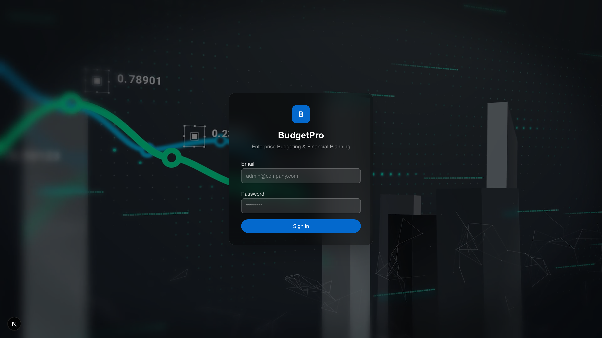

Kredensiyalar sistem administratoru tərəfindən verilir. Əgər siz administratorsunuz və stendi indicə deploy etmisiniz — şifrə `scripts/create-admin.ts` faylında və ya deploy gizliləri arasındadır.

> 🔒 Şifrələr açıq sənədlərdə dərc edilmir.

### 2.2 Yan naviqasiya

Girdikdən sonra solda — 6 əsas bölmə:

| İkon | Bölmə | Nə üçün |
|---|---|---|
| 📊 | **Budgeting** | Plan/fakt, P&L, BS, CF — ənənəvi FP&A |
| 🎯 | **Risk Terminal** | Bloomberg-üslub terminal — günün əsas ekranı |
| 📋 | **Board Deck** | Direktorlar şurası üçün snapshot (çap / PPTX / PDF) |
| 🚀 | **Onboarding** | Şirkətlərin hazırlığı + AI vasitəsilə yenilərin idxalı |
| 📜 | **Audit Log** | Bütün mühüm dəyişikliklərin jurnalı |
| 🛠️ | **Admin Tools** | 4 qrupda 16 utilit |
| ⚙️ | **Settings** | Profil + dil + seçimlər |

---

## 3. Risk Terminal — maliyyəçinin iş günü

**URL:** `/budgeting/terminal`

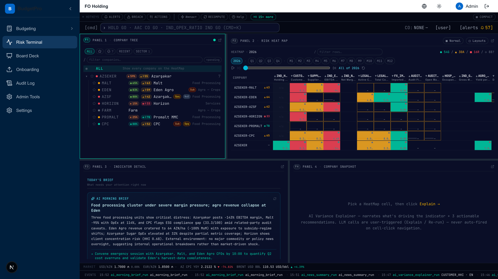

Bu **əsas ekrandır**. Səhər açırsınız — lazım olan hər şey buradadır.

### Dörd panel

#### Panel 1 · Company Tree (yuxarıda solda)
Holdinqin bütün şirkətlərinin ağacı, hər biri üçün **composite-score** nişanı ilə:
- 🟢 **yaşıl %** — composite score (0-100)
- 🔴 **R##** — qırmızı göstəricilərin sayı
- **Çiplər:** `Sub` / `Opq` / `NoD` — keyfiyyət risk bayraqları (bölmə 9-a bax)

**Nəyi yoxlamaq lazımdır:** şirkətə klik → sağ HeatMap həmin şirkətə görə filtrlənir.

#### Panel 2 · Risk HeatMap (yuxarıda sağda)
**Matris: şirkətlər × göstəricilər.** Xananın rəngi = status (yaşıl/sarı/qırmızı/m/y).

Hər xana təkcə rənglə deyil, həm də **forma ilə** işarələnib (▲ / ● / ○) — clinical color-blind safety üçün (Phase M7 reqressiya skanı geri qaytarmağı qadağan edir).

Yuxarıda:
- Rüb filtri (2026 / Q1...Q4 / M1...M12)
- `Material only` — tətbiq olunmayan göstəriciləri gizlət
- Sayğac: `54G / 30A / 16R / 88?`

**Nəyi yoxlamaq lazımdır:** kursoru xanaya gətirin → tooltip rəqəm + planlı diapazonda göstərir.

#### Panel 3 · Indicator Detail (aşağıda solda)
Defolt olaraq **«Today's brief»** göstərir — səhər AI brifinqi.

HeatMap xanasına klik edəndə **göstərici detalizasiyasına** çevrilir:
- Formula (`counterparty_hhi_customer`)
- Resolved variables
- BudgetLine-dan mənbə sətirləri
- Düymələr: `Discuss` / `Benchmark` / **`Explain →`**

#### Panel 4 · Company Snapshot / Variance Explainer (aşağıda sağda)
- Defolt: «Pick a HeatMap cell, then click Explain →» məsləhəti
- Şirkətə klik edəndən sonra: **Company Snapshot** (top alertlər + breakdown)
- `Explain →` kliklədikdən sonra: **AI Variance Explainer** — narrative + 3 tövsiyə

### 60 saniyə ərzində nəyi yoxlamaq lazımdır
1. AZSEKER ağacını açın → composite-score ilə 7 sub-co olmalıdır
2. Qırmızı xanaya klikləyin EDEN sətiri, CUSTOMER_HHI sütunu → Panel 3 formulu göstərir, Panel 4 — Explain düyməsi
3. Explain basın → ~15 saniyə sonra narrative TOP DRIVERS və RECOMMENDATIONS ilə görünür
4. Aşağıda — EVENTS lenti (son LLM çağırışları) və MARKET (USD/AZN, EUR/AZN, Brent)

---

## 4. Board Deck — şura üçün snapshot

**URL:** `/budgeting/board-deck?period=2026`

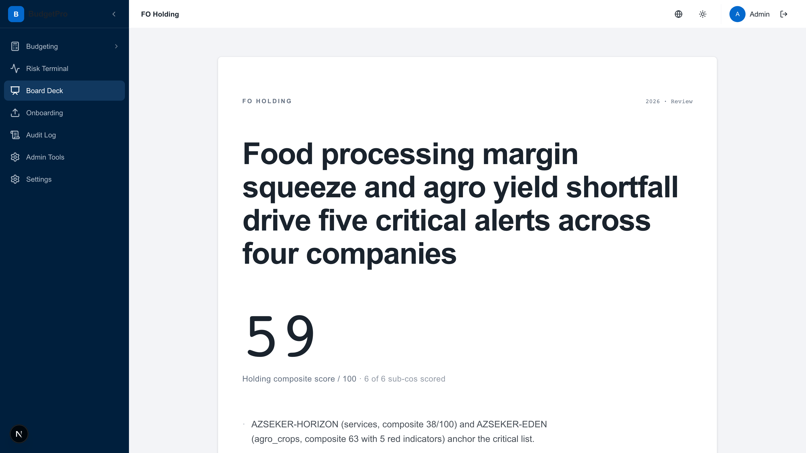

**Məqsəd:** direktorlar şurası üçün bir səhifəli sənəd. Açırsınız → oxuyursunuz → «Print to PDF» basırsınız → çata göndərirsiniz.

### Nələr var
1. **Başlıq-narrative** — AI bir cümlə generasiya edir, məsələn *«Food processing margin squeeze and agro yield shortfall drive five critical alerts across four companies»*
2. **Holding composite score** — böyük rəqəm
3. **Top movers** — kim plan/fakt üzrə ən çox yuxarı/aşağı
4. **Alerts** — həddlərin kritik pozuntuları
5. **🆕 Qualitative Risk Flags** — keyfiyyət risk bayraqları olan şirkətlər bölməsi

### Keyfiyyət riskləri bölməsinin skrinşotu (səhifənin aşağısı)

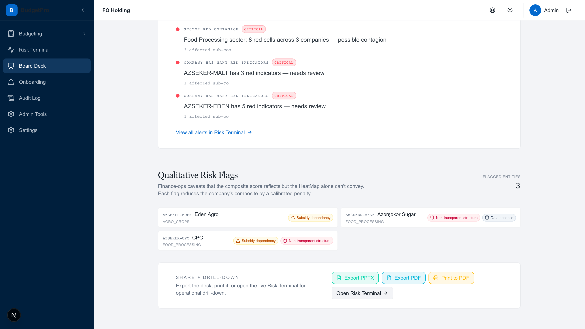

Burada görünür:
- **AZSEKER-EDEN** Eden Agro — `Subsidy dependency`
- **AZSEKER-AZSF** Azərşəkər Sugar — `Non-transparent structure` + `Data absence`
- **AZSEKER-CPC** CPC — `Subsidy dependency` + `Non-transparent structure`

Bu bayraqlar **avtomatik olaraq şirkətin composite score-nu azaldır** və səhər brifinqinə düşür (bölmə 9-a bax).

### Export düymələri
- `Export PPTX` — bayt-bayt eyni PowerPoint təqdimatı
- `Export PDF` — server render vasitəsilə PDF
- `Print to PDF` — brauzer çapı
- `Open Risk Terminal →` — drill-down üçün canlı terminalə keçid

---

## 5. Büdcələşdirmə

**URL:** `/budgeting`

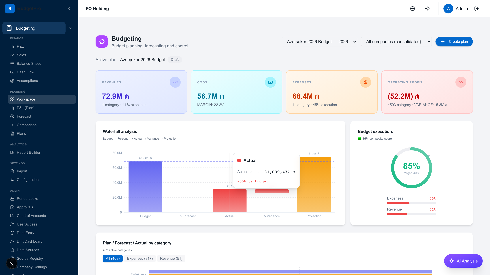

**Bu «adi» FP&A workspace-dir** — maliyyəçinin Excel-də etdiyi işi indi burada edir.

### Sol sidebar — işin strukturu

**FINANCE** — üç klassik hesabat:
- 📈 **P&L** — mənfəət və zərər haqqında hesabat
- 💰 **Sales** — satışların detalizasiyası
- 📑 **Balance Sheet** — balans
- 💸 **Cash Flow** — pul hərəkəti
- 📐 **Assumptions** — model üçün fərziyyələr

**PLANNING** — nəyi planlaşdırırıq:
- 🗂️ **Workspace** — büdcənin əsas ekranı (skrinşotda)
- 📊 **P&L (Plan)** — P&L formatında plan
- 🔮 **Forecast** — proqnoz
- ⚖️ **Comparison** — plan vs fakt vs forecast
- 📅 **Plans** — bütün planların siyahısı

**ANALYTICS** — ixtiyari kəsiklər üçün Report Builder.

**SETTINGS** — Import / Configuration.

**ADMIN** — dərin parametrlər (Period Locks, Approvals, Chart of Accounts, User Access, Drift Dashboard, Source Registry, Data Sources, **Company Settings ← burada Risk Registry**).

### Əsas Workspace ekranında nələr var
- Yuxarıda 4 KPI kartı: **Revenues / COGS / Expenses / Operating Profit** icra % və variance ilə
- **Waterfall analysis** — Budget → Forecast → Actual → Variance → Projection
- **Budget execution** — donut 85% / 65% composite score
- **Plan/Forecast/Actual by category** — ətraflı cədvəl

### Nəyi yoxlamaq lazımdır
1. Yuxarıda başlığın sağında — plan selektoru (`Azərşəkər 2026 Budget — 2026`) və şirkətlər (`All companies (consolidated)`)
2. `+ Create plan` düyməsi — yeni plan yaradır
3. Aşağıda sağda — `AI Analysis` düyməsi (bənövşəyi)

---

## 6. Yeni şirkətin onboarding

**URL:** `/budgeting/onboarding`

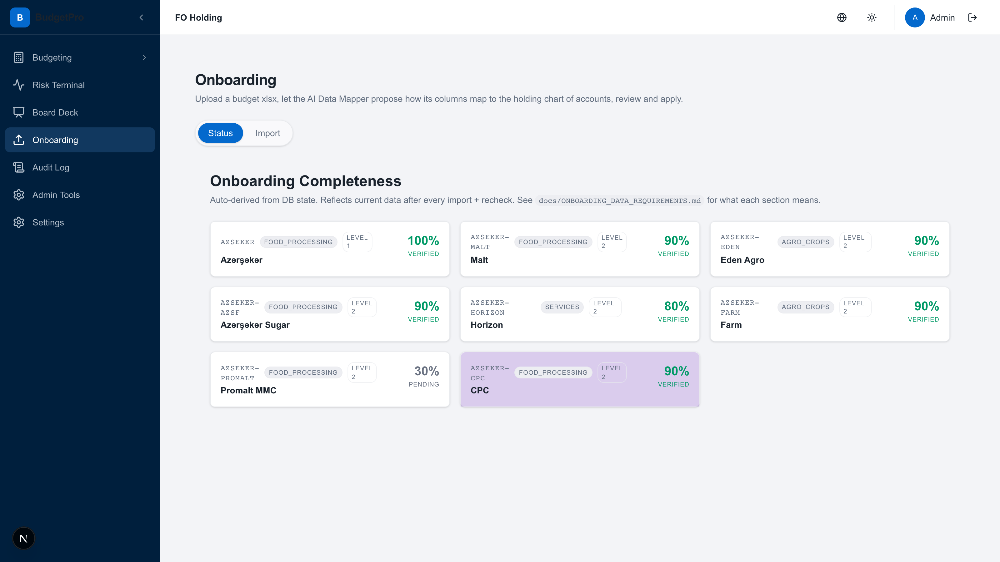

**Məqsəd:** holdinqin hər şirkəti üzrə məlumat daxiletmə tərəqqisini göstərmək və "boş" bölmələri tamamlamağa kömək etmək.

### Nələr görünür
- Səviyyə ilə **şirkət kartları** (LEVEL 1 = ana, LEVEL 2 = sub-co)
- **Hazırlıq faizi** + status: `VERIFIED` (>90%), `PENDING` (<90%)
- **Rəng vurğulanması:** yaşıl CPC (90%), bənövşəyi — drill-down üçün seçilmiş

### Demomuzda nə göstərilir
| Code | Name | Industry | Hazırlıq | Status |
|---|---|---|---|---|
| AZSEKER | Azərşəkər | food_processing | 100% | ✅ VERIFIED |
| AZSEKER-MALT | Malt | food_processing | 90% | ✅ VERIFIED |
| AZSEKER-EDEN | Eden Agro | agro_crops | 90% | ✅ VERIFIED |
| AZSEKER-AZSF | Azərşəkər Sugar | food_processing | 90% | ✅ VERIFIED |
| AZSEKER-HORIZON | Horizon | services | 80% | ✅ VERIFIED |
| AZSEKER-FARM | Farm | agro_crops | 90% | ✅ VERIFIED |
| AZSEKER-PROMALT | Promalt MMC | food_processing | 30% | ⏳ PENDING |
| AZSEKER-CPC | CPC | food_processing | 90% | ✅ VERIFIED |

**Nəyi yoxlamaq lazımdır:** kartı klikləyin → hansı bölmələrin (P&L / BS / CF / KPI / Descriptions / Land / CAPEX) doldurulduğunu, hansıların tamamlanmalı olduğunu göstərən detail açılır.

---

## 7. Admin Tools — 4 qrupda 16 alət

**URL:** `/budgeting/admin`

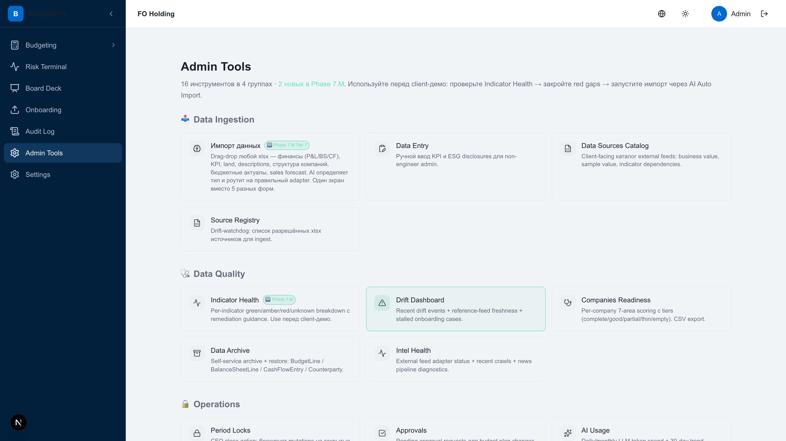

**Bu «mühəndislik panelidir»** — **müştəri demosundan əvvəl** və gündəlik dəstək üçün istifadə edilən.

### Dörd qrup

#### 🧪 Data Ingestion (məlumat yükləmə)
| Kart | Nə edir |
|---|---|
| **Импорт данных** `Phase 7.M Tier 7` | İstənilən xlsx-i drag-drop → AI tipi müəyyən edir (P&L/BS/CF/KPI/Land/CAPEX/Descriptions/Forecast) və düzgün adaptera yönləndirir. 5 fərqli forma əvəzinə bir ekran. |
| **Data Entry** | Non-engineer admin üçün KPI və ESG disclosure-ların əl ilə daxil edilməsi. |
| **Data Sources Catalog** | Müştəriyə yönəlmiş xarici feed-lərin siyahısı: biznes dəyəri, nümunə dəyəri, asılılıqlar. |
| **Source Registry** | Drift-watchdog: ingest üçün icazə verilmiş xlsx mənbələrinin siyahısı. |

#### 🩺 Data Quality (məlumat keyfiyyəti)
| Kart | Nə edir |
|---|---|
| **Indicator Health** `Phase 7.M` | Göstərici üzrə yaşıl/sarı/qırmızı/naməlum remediation guidance ilə. **Müştəri demosundan əvvəl** istifadə edin. |
| **Drift Dashboard** | Son drift hadisələri + reference-feed yenilik + dayanmış onboarding halları. |
| **Companies Readiness** | Entity üzrə 7 sahə üzrə qiymətləndirmə tierlər ilə (complete/good/partial/thin/empty). CSV export. |
| **Data Archive** | Self-service arxiv + bərpa: BudgetLine / BalanceSheetLine / CashFlowEntry / Counterparty. |
| **Intel Health** | External feed adapter statusu + son crawl-lar + xəbər pipeline diaqnostikası. |

#### 🔒 Operations (əməliyyatlar)
- **Period Locks** — bağlı dövrlərin mutasiyalardan qorunması
- **Approvals** — dəyişikliklərin razılaşdırılması workflow
- **AI Usage** — 30 günlük trend ilə LLM xərclərinin monitorinqi

#### 👥 Access (girişlər)
- **User Access** — istifadəçi və rol idarəetməsi
- **API Keys** — xarici inteqrasiyalar üçün maşın açarları

### 7.1 Indicator Health — demodan əvvəl mütləq yoxlamaq

**URL:** `/budgeting/admin/indicator-health`

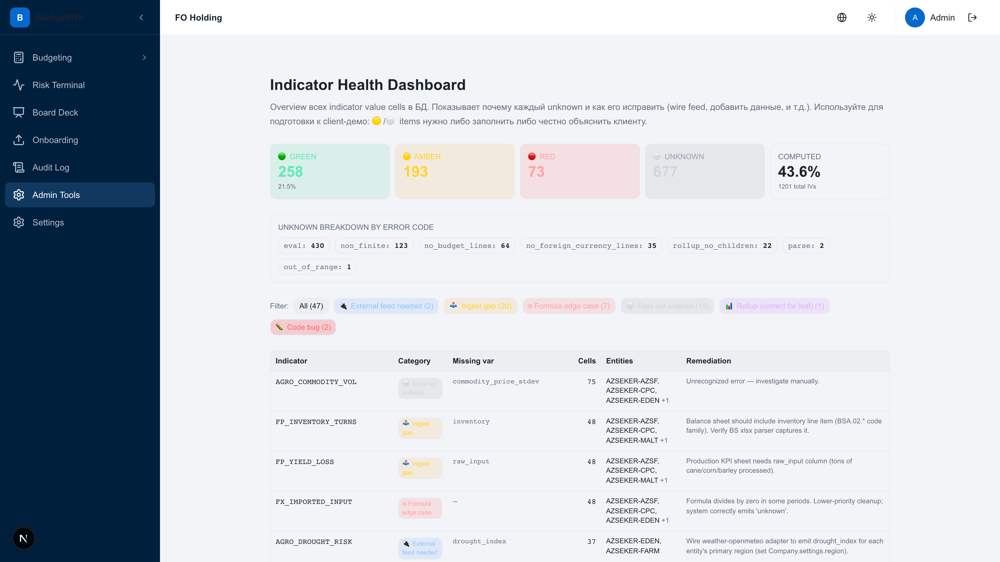

**Yuxarıda:** sayğaclar
- 🟢 GREEN: 258 (21.5%)
- 🟡 AMBER: 193
- 🔴 RED: 73
- ⚪ UNKNOWN: 677 (1201 total IV-dən 43.6% hesablanıb)

**Xəta koduna görə Unknown breakdown:**
- `eval: 430` — formullar uğursuz oldu
- `non_finite: 123` — sıfıra bölmə / NaN
- `no_budget_lines: 64` — P&L-də mənbə yoxdur
- `no_foreign_currency_lines: 35`
- `rollup_no_children: 22`
- `parse: 2`
- `out_of_range: 1`

**Aşağıda:** problemli konkret göstəricilərin siyahısı + bir sətirdə remediation.

**Demodan əvvəl nəyi yoxlamaq lazımdır:**
1. **AGRO_COMMODITY_VOL** → 75 xana, araşdırma lazımdır
2. **FP_INVENTORY_TURNS** → 49 xana, BS-də `inventory` lazımdır
3. **FP_YIELD_LOSS** → 49 xana, istehsal KPI-da `raw_input` lazımdır
4. **AGRO_DROUGHT_RISK** → 37 xana, entity üzrə `drought_index` lazımdır

### 7.2 Companies Readiness — hazırlıq şəbəkəsi

**URL:** `/budgeting/admin/companies-readiness`

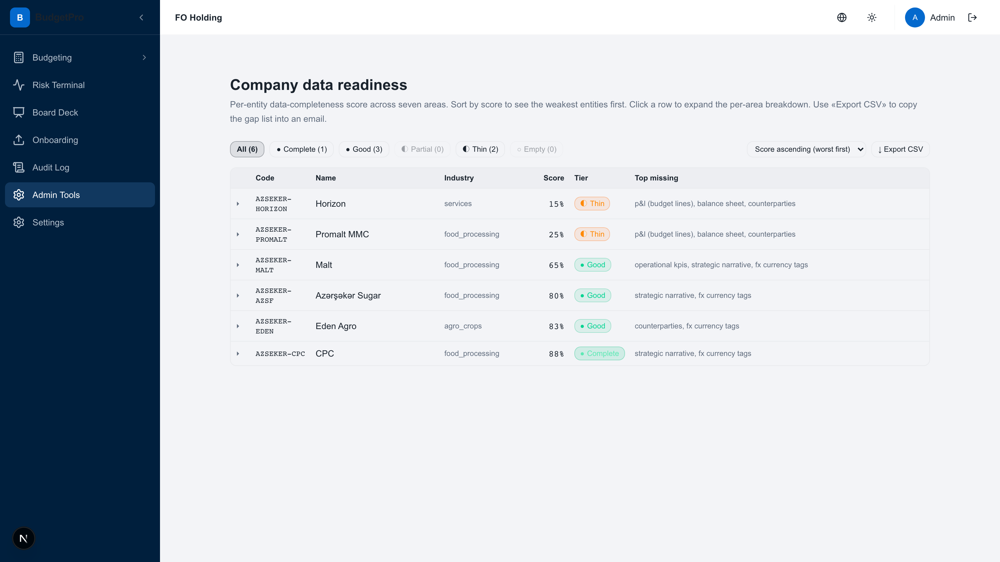

Entity üzrə 7 sahə üzrə qiymətləndirmə: P&L / BS / CF / KPI / Counterparty / FX tags / Strategic narrative.

Sütunlar:
- **Score** — 0-100%
- **Tier** — Complete / Good / Partial / Thin / Empty
- **Top missing** — tier-i qaldırmaq üçün nə əlavə etmək lazımdır

**Skrinşotda görünür:**
- HORIZON 15% Thin → P&L (budget lines), balance sheet, counterparties lazımdır
- PROMALT 25% Thin → eyni
- MALT 65% Good → operational KPIs, strategic narrative, FX tags lazımdır
- AZSF 80% Good → strategic narrative, FX tags
- EDEN 83% Good → counterparties, FX tags
- CPC 88% Complete → strategic narrative, FX tags

**Export CSV** düyməsi email üçün gap-list kopyalayır.

### 7.3 Data Archive — bərpa ilə soft-delete

**URL:** `/budgeting/admin/data-archive`

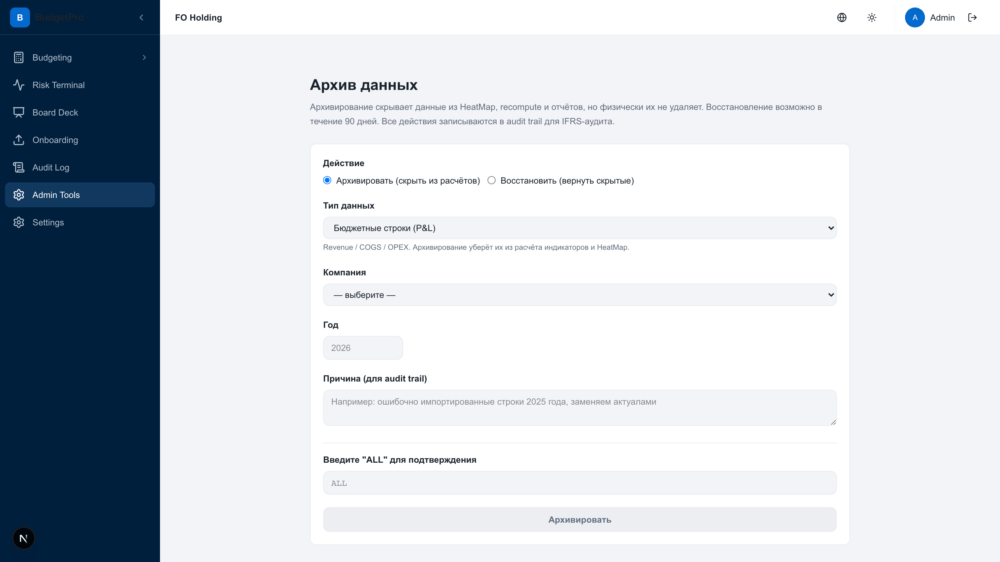

**Nə üçün:** idxalda səhv olub → sətirləri hesablamadan çıxarmaq lazımdır, **amma IFRS auditi üçün fiziki silmədən**.

**Necə işləyir:**
- Arxivləmə məlumatları HeatMap, recompute, hesabatlardan gizlədir
- Fiziki olaraq məlumatlar **silinmir** — **90 gün** ərzində bərpa mümkündür
- Bütün əməliyyatlar audit trail-ə yazılır
- 90 gündən sonra — gündəlik cron `soft-delete-purge` fiziki olaraq silir

**Forma:**
- **Əməliyyat:** Arxivləmək / Bərpa etmək
- **Növ:** P&L / BS / CF / Counterparty
- **Şirkət + İl**
- **Səbəb** (audit log-a düşür)
- **Təsdiq:** səhvi istisna etmək üçün `ALL` daxil edin

---

## 8. AI Auto Import — istənilən Excel-in idxalı

**URL:** `/budgeting/admin/ai-import`

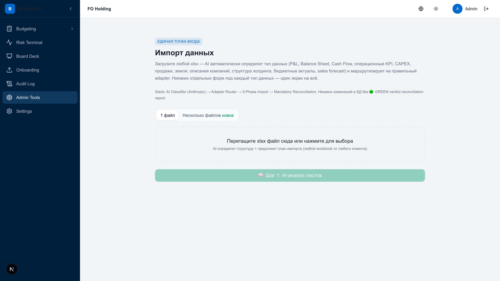

**Bu əl ilə mapping-in qatilidir.** Phase 7.M Tier 7-yə qədər hər yeni xlsx kod tələb edirdi. İndi:

### Necə işləyir (5 faza)
1. **AI Classifier** (Anthropic) — vərəqin dataType-ını müəyyən edir: P&L / BS / CF / Sales / KPI / Land / CAPEX / Descriptions / Forecast
2. **Adapter Router** — reyestrdən düzgün adapteri seçir (11 dataType)
3. **5-Phase Import** — parse → validate → upsert CoA → write → recompute
4. **Mandatory Reconciliation** — hər idxal mənbə ilə yoxlanılır
5. **GREEN verdict** — uyğunsuzluq yoxdur və ya diff görürsünüz

### İki rejim
- **`1 файл`** — standart, bir workbook üçün
- **`Несколько файлов`** 🆕 — multi-file orchestrator (Phase 7.M Tier 5)
  - Eyni vaxtda 1-10 fayl
  - **Qrup səviyyəli atomiklik** — ya bütün qruplar yazılır, ya heç biri
  - **Fayllar arası konflikt aşkarlanması** — iki fayl eyni xanaya fərqli yazırsa → 409 diff ilə
  - Bütün qruplardan sonra bir recompute (N əvəzinə)

### Nəyi yoxlamaq lazımdır
1. İstənilən xlsx-i `Перетащите xlsx файл сюда` zonasına drag-drop edin
2. `Шаг 1: AI-анализ листов` basın
3. AI klassifikasiya qaytarır + plan import təklif edir
4. Təsdiq edirsiniz → fayl idxal olunur → avtomatik recompute

### Məhdudiyyətlər
- Tək fayl: ≤ 20 MB
- Multi file: ≤ 10 fayl, ≤ 20 MB cəmi
- Rate limit: 3 multi-file idxal/saat/org
- Cost cap: əvvəlcədən yoxlanılır (N × 35K token)

---

## 9. Risk Registry — keyfiyyət risk bayraqları

**URL:** `/budgeting/admin/companies` → **«Настройки компаний»** bölməsi → şirkət kartını genişləndirin

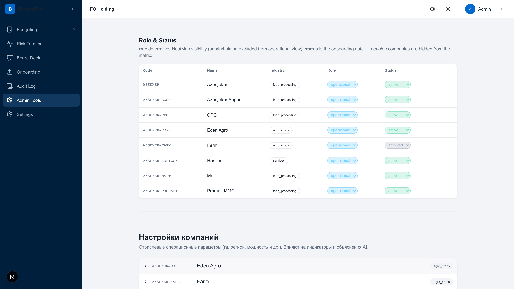

**Bu ən yeni fiçadır (Phase 7.N, may 2026).** HeatMap-in kəmiyyətcə göstərmə digi keyfiyyət maliyyə-əməliyyat riskləri.

### Üç kanonik bayaq

| Bayraq | Emoji | Nə deməkdir | Composite-ə cərimə |
|---|---|---|---|
| `subsidy_dependency` | ⚠️ | Gəlir və ya marja əhəmiyyətli dərəcədə subsidiyalardan və ya tənzimlənən qiymətlərdən asılıdır | **−5** |
| `non_transparent_structure` | 🛡 | Related-party və ya unaudited cost-allocation paterni | **−8** |
| `data_absence` | ⚪ | Əsas maliyyə və ya əməliyyat məlumatları yoxdur | **−12** |

### Necə qoymaq
1. `/budgeting/admin/companies`
2. **«Настройки компаний»** bölməsi (səhifənin aşağısı)
3. Şirkət kartını açın (məsələn, AZSEKER-EDEN)
4. **«Risk Registry»** tapın — ciddilik nöqtələri `● ● ●` (emerald → amber → rose) ilə 8 kateqoriyaya görə sıralanıb
5. Lazımlı bayrağa klikləyin — vurğulanır, cərimə saxladıqdan sonra tətbiq olunur

### Bu bayraqlar hara düşür (4 kanal, end-to-end yoxlanılıb)

| Kanal | Harada görəcəksiniz |
|---|---|
| **Composite score badges** | Risk Terminal → Company Tree (ad yanında `Sub` / `Opq` / `NoD` çipləri) |
| **Morning Brief narrative** | Risk Terminal → Today's Brief (*«exposure to government policy/subsidy regime»* kimi ifadələr) |
| **Board Deck section** | Board Deck → **«Qualitative Risk Flags»** bölməsi FLAGGED ENTITIES sayı ilə |
| **Variance Explainer** | Risk Terminal → xanaya klik → Explain → tövsiyə #3 bayrağı sitatlaşdırır |

### Verilənlər bazasının cari vəziyyəti
- **AZSEKER-AZSF** → `non_transparent_structure` + `data_absence` = **composite-ə −20**
- **AZSEKER-CPC** → `subsidy_dependency` + `non_transparent_structure` = **−13**
- **AZSEKER-EDEN** → `subsidy_dependency` = **−5**

---

## 10. AI funksiyaları — nə, harada, nə qədər başa gəlir

Bütün LLM çağırışları serverside API vasitəsilə **Anthropic Claude**-a gedir (cost mode + retry policy).

### 10.1 Morning Brief (səhər brifinqi)

**Harada:** Risk Terminal → Panel 3 → «Today's Brief» bölməsi

**Nə edir:** bir cümlə ilə günün risk klasterini təsvir edir + sektorlar üzrə «top worst»-u sadalayır. Keyfiyyət risk bayraqlarını nəzərə alır.

**Çıxış nümunəsi (canlı, verilənlər bazasından):**
> *Food processing cluster under severe margin pressure; agro revenue collapse at Eden. Three food processing units show critical distress: Azərşəkər posts −143% EBITDA margin, Malt −95% with 114% OpEx, and CPC flags ESG compliance gap (33.3/100) amid related-party audit caveats. Eden Agro revenue cratered to 64 AZN/ha (1004% MoM) with exposure to subsidy-regime shifts; Azərşəkər Sugar Q4Y rejected at 535 despite partial metric coverage. Horizon shows client concentration risk (HHI 0.48). External environment: no major commodity or policy news overnight, suggesting internal-operational breakdowns rather than market-driven shock.*

**Dillər:** EN / RU / AZ (panelin sağ yuxarı küncündə keçid).

**Keş necə işləyir:** prompt mətni + dataset hash-in sha256. Promptu dəyişdiririk → köhnə keş avtomatik olaraq etibarsızlaşır.

### 10.2 Variance Explainer (kənarlaşma izahçısı)

**Harada:** Risk Terminal → HeatMap xanasına klik → `Explain →` düyməsi

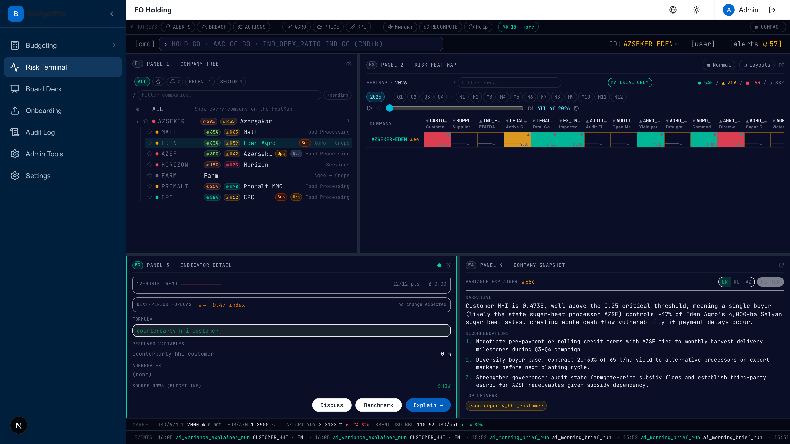

**Nə edir:** narrative (1-3 cümlə) + 3 actionable tövsiyə + TOP DRIVERS siyahısı.

**EDEN Customer HHI üçün çıxış nümunəsi:**
> NARRATIVE: *Customer HHI is 0.4738, well above the 0.25 critical threshold, meaning a single buyer (likely the state sugar-beet processor AZSF) controls ~67% of Eden Agro's 4,000 ha Salyan sugar-beet sales, creating acute cash-flow vulnerability if payment delays occur.*
>
> RECOMMENDATIONS:
> 1. Negotiate pre-payment or rolling credit terms with AZSF tied to monthly harvest delivery milestones during Q3...
> 2. Diversify buyer base: contract 20-30% of Q3 yield to alternative processors or export markets before next planting cycle.
> 3. Strengthen governance: audit state farmgate-price subsidy flows and establish third-party benchmarks for AZSF **intercompany subsidy dependence**.

Qeyd edin — tövsiyə #3 Risk Registry səhifəsindən `subsidy_dependency` risk bayrağını sitatlaşdırır.

**Dəyəri:** çağırış başına ~1200 in + ~240 out token (~ $0.01).

### 10.3 Board Deck Narration

**Harada:** Board Deck açılanda avtomatik generasiya olunur.

**Nə edir:** kəmiyyət siqnallarını *«Food processing margin squeeze and agro yield shortfall drive five critical alerts across four companies»* kimi bir cümlə başlığa çevirir.

(orgId, period) üzərində keşlənir — saatda maksimum bir çağırış.

### 10.4 AI Auto Import Classifier

**Harada:** Admin → AI Auto Import → faylı drag-drop.

**Nə edir:** istənilən xlsx üçün smart-routing. Tam workbook (testdə 23 vərəq / 14 entity) üçün ~$0.13 başa gəlir. Yeni adapterlər yoxdur — AI özü tipi müəyyən edib düzgün pipeline seçir.

---

## 11. Audit jurnalı

**URL:** `/budgeting/audit`

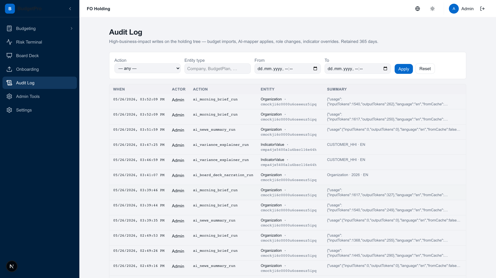

**Məqsəd:** bütün mühüm dəyişikliklərin IFRS-uyğun jurnalı. 365 gün saxlanılır.

### Nələr yazılır
- Bütün idxallar (filename, dəyişən sətirlər, status)
- Bütün mapper tətbiqləri
- Rol dəyişiklikləri
- Göstərici override-ları
- LLM çağırışları (model, prompt versiyası, tokenlər, fromCache)
- **Soft-delete və physical purge** (Phase 1.4 cron)

### Filtrlər
- **Action** — hadisə növü
- **Entity type** — Organization / Company / IndicatorValue / ChartOfAccount
- **From / To** — tarix diapazonu
- **Düymələr:** Apply / Reset

### Nəyi yoxlamaq lazımdır
- Cədvəldə `ai_morning_brief_run`, `ai_news_summary_run`, `ai_variance_explainer_run`, `ai_board_deck_narration_run` qeydləri görünür
- ACTOR sütunu — əl əməliyyatları üçün `Admin`
- SUMMARY `model`, `inputTokens`, `outputTokens`, `language`, `fromCache` ilə JSON ehtiva edir
- Qeydlər yenidən köhnəyə sıralanıb

---

## 12. Özünü yoxlama çek-listi

**İndi** canlı tətbiqdə klikləyərək bu siyahıdan keçin. Əgər nəsə uyğun gəlmirsə — hardasa səhv var, düzəlişi növbəyə qoymaq lazımdır.

### Əsas naviqasiya
- [ ] `/login` → admin kredensiyaları ilə daxil olun → `/budgeting`-ə yönləndirmə
- [ ] Sidebar 6 bənd göstərir: Budgeting / Risk Terminal / Board Deck / Onboarding / Audit Log / Admin Tools + Settings
- [ ] Tema keçidi (günəş/ay) sağ yuxarı küncdə işləyir

### Risk Terminal (`/budgeting/terminal`)
- [ ] Panel 1: AZSEKER ağacı açılır, composite-score ilə 7 sub-co görünür (59%, 65%, 83%, 80%, 15%, ...)
- [ ] Panel 1: EDEN yanında `Sub` etiketi, AZSF yanında — `Opq` + `NoD`
- [ ] Panel 2: HeatMap 3 AZSEKER-* sətri göstərir (MALT 63, EDEN 64, AZSF 62)
- [ ] Panel 3: «Today's brief» yüklənir, mətn «subsidy-regime» və ya «non-transparent» qeydlərini ehtiva edir (bu AI Morning Brief risk bayraqları ilə)
- [ ] EDEN sətiri, CUSTOMER_HHI sütununda qırmızı xanaya klik → Panel 3 `counterparty_hhi_customer` formulunu göstərir
- [ ] `Explain →` klikləyin → ~15 saniyə sonra narrative + 3 tövsiyə görünür
- [ ] Tövsiyə #3-də **subsidy dependency** ifadəsi (və ya əlaqəli) sitatlaşdırılır

### Board Deck (`/budgeting/board-deck?period=2026`)
- [ ] AI başlığı mövcuddur («Food processing margin squeeze...» kimi nəsə)
- [ ] Holding composite score = **59** (yazılma zamanı)
- [ ] Aşağı sürüşdürün → **«Qualitative Risk Flags»** bölməsi görünür
- [ ] FLAGGED ENTITIES = **3**
- [ ] AZSEKER-EDEN kartı → `Subsidy dependency` çipi (amber)
- [ ] AZSEKER-AZSF kartı → `Non-transparent structure` (rose) + `Data absence` (slate)
- [ ] AZSEKER-CPC kartı → `Subsidy dependency` + `Non-transparent structure`
- [ ] `Export PPTX`, `Export PDF`, `Print to PDF` düymələri mövcuddur

### Büdcələşdirmə (`/budgeting`)
- [ ] Yuxarıda 4 KPI kartı (Revenues / COGS / Expenses / Operating Profit)
- [ ] Waterfall chart üzərinə gəldikdə tooltip (Actual 31,039,477 ₼ -55% vs budget)
- [ ] Plan selektoru `Azərşəkər 2026 Budget — 2026`
- [ ] Sidebar: ANALYTICS → Report Builder işləyir

### Onboarding (`/budgeting/onboarding`)
- [ ] 8 entity kartı: AZSEKER (100%) + 7 sub-co
- [ ] PROMALT MMC = 30% PENDING — yeganə PENDING
- [ ] Qalanları ≥ 80% VERIFIED

### Admin Tools (`/budgeting/admin`)
- [ ] Landing 4 qrupda 16 kart göstərir
- [ ] `Импорт данных` və `Indicator Health` kartları `Phase 7 M` nişanı ilə
- [ ] Bütün kartlar kliklənidir

### AI Auto Import (`/budgeting/admin/ai-import`)
- [ ] İki tab: `1 файл` / `Несколько файлов` (yenisi `новое` ilə)
- [ ] Drop-zona mövcuddur
- [ ] `Шаг 1: AI-анализ листов` düyməsi var

### Indicator Health (`/budgeting/admin/indicator-health`)
- [ ] Xülasə: GREEN 258 / AMBER 193 / RED 73 / UNKNOWN 677 / COMPUTED 43.6%
- [ ] Xəta koduna görə breakdown görünür
- [ ] Filter çipləri: All / External feed needed / Input gap / Formula edge case / Data not loaded / Rollup correct fix? / Code bug

### Companies Readiness (`/budgeting/admin/companies-readiness`)
- [ ] 6 entity cədvəli Score asc üzrə sıralanır (ən pis birinci)
- [ ] HORIZON və PROMALT MMC aşağıda Thin tier ilə
- [ ] `Export CSV` düyməsi işləyir

### Data Archive (`/budgeting/admin/data-archive`)
- [ ] Əməliyyat / Məlumat növü / Şirkət / İl / Səbəb / `ALL` təsdiq sahələri ilə forma
- [ ] `Архивировать (скрыть из расчётов)` radio defolt olaraq seçilib

### Company Settings + Risk Registry (`/budgeting/admin/companies`)
- [ ] Yuxarıda Role & Status cədvəli 8 entity ilə
- [ ] Aşağıda «Настройки компаний» açılan kartlar ilə
- [ ] EDEN kartında — 8 kateqoriya ilə **Risk Registry** bölməsi
- [ ] Kateqoriyalar: Regulatory & compliance / Financial / Operational / Strategic / ESG / Market / Cyber / Reputational
- [ ] Ciddilik `● ● ●` nöqtələri ilə göstərilir (emerald / amber / rose)

### Audit Log (`/budgeting/audit`)
- [ ] Hadisə cədvəli, yenilər yuxarıda
- [ ] `ai_morning_brief_run`, `ai_variance_explainer_run` qeydləri mövcuddur
- [ ] SUMMARY tokens + language + fromCache ilə JSON ehtiva edir

### AI çağırışları (Audit Log vasitəsilə)
- [ ] Son 24 saat ərzində ən azı bir `ai_variance_explainer_run`
- [ ] Bu gün üçün `ai_morning_brief_run` var
- [ ] `ai_board_deck_narration_run` var (Board Deck açılanda generasiya olunur)
- [ ] Eyni parametrli təkrar sorğular üçün `fromCache: true`

---

## Nəsə pozularsa hara müraciət etmək

| Simptom | Hara baxmaq |
|---|---|
| Composite score yenidən hesablanmadı | `Risk Terminal → Recompute` düyməsi |
| AI brief köhnədir | Audit Log → son `ai_morning_brief_run` tapın → `fromCache` yoxlayın |
| HeatMap boşdur | `Indicator Health` → UNKNOWN breakdown-u yoxlayın |
| İdxal uğursuz oldu | `Admin → Drift Dashboard` → son hadisələr |
| İdxalı geri qaytarmaq lazımdır | `Admin → Data Archive` → məlumat növü + il + səbəb seçin → ALL |
| Dövrü təsadüfən bağlamışıq | `Admin → Period Locks` → unlock + audit |

---

## Yoxlayan üçün texniki detallar

- **Stack:** Next.js 16 (Turbopack) + Prisma 6.19 + PostgreSQL 16 + Redis (BullMQ)
- **AI:** `@anthropic-ai/sdk` vasitəsilə Anthropic Claude serverside caching ilə
- **Auth:** NextAuth credentials provider (`/login`)
- **Dev server:** 3000 portunda LaunchAgent (`launchctl kickstart -k gui/501/com.budgetpro.dev`)
- **Testlər:** `npx vitest run` (5042 passing) + `npx tsc --noEmit` (CI gate)
- **Pre-commit:** M7 status-band scanner + secret scanner (~150ms)
- **Migration policy:** bütün miqrasiyalar Prisma vasitəsilə + audit; 90 günlük fiziki purge cron ilə soft-delete
- **Cost guard rails:** rate-limits + token budgets + env-də LLM kill switch

---

> Sənəd 26 may 2026-cı il tarixində, Phase 7.N (4 kanalda risk bayraqları) bağlandıqdan sonra generasiya edilib.
> Skrinşot mənbəyi: canlı dev environment, headless Playwright 1.59.1, viewport 1600×900 @2x.
